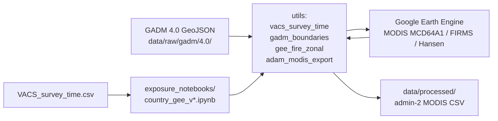

# VACS exposure & harmonization (research_side_projects_ipv)

Country-level workflows for **satellite exposure** (Earth Engine), **survey outcome codebooks**, and **covariate codebooks** ahead of VACS analysis. Shared helpers live in `utils/`; country work is mostly notebooks under `exposure_notebooks/` and `covariates_notebooks/`.

## Exposure workflow (orchestration)

**Flow:** §1 sets the **12-month exposure window** before fieldwork; §3 loads **admin‑2 regions** (GADM 4.0 for Zimbabwe POC; Zambia pilots still use FAO GAUL 2015); §4–§5 are optional EDA (burn / hot pixels); §6 exports district×month MODIS with rolling 12 and MoM.

**Scaling to more countries:** [`howto_docs/modis_gadm_country_pipeline.md`](howto_docs/modis_gadm_country_pipeline.md) (checklist + full Mermaid diagram). Per country: pick GADM version → download 2 GeoJSON files → copy notebook → run §1–§6.

## Outcome variables

Per-country **Stata PUD** files are parsed into standardized **outcome codebooks** (variable, type, format, survey questions) via `scripts/parse_*_outcome_questions.py` and `utils/outcomes.py`. Outputs are TSV/codebook tables for PI review and later merge to analysis—no GEE step.

## Covariates

Per-country notebooks in `covariates_notebooks/` document **covariate candidates** from PUDs and build **covariate codebooks** (same column template as outcomes). Country-specific label/value logic sits in `utils/*_covariate_*` and `scripts/build_*_covariate_codebook.py`.

## Repo map (minimal)

| Path | Role |
|------|------|
| `exposure_notebooks/` | GEE fire / MODIS / FIRMS by country |
| `covariates_notebooks/` | Covariate exploration & codebooks |
| `utils/` | Shared Python (boundaries, export, survey dates) |
| `gee_zambia/` | Hansen zonal script + Zambia GEE notes |
| `data/raw/gadm/` | Local GADM boundaries (not in git) |
| `data/processed/` | MODIS deliverable CSVs |
| `howto_docs/` | Pipeline walkthroughs |

**Setup:** Python 3.11+ venv, `pip install -r requirements.txt`, Earth Engine auth + `.env` for GEE notebooks.
