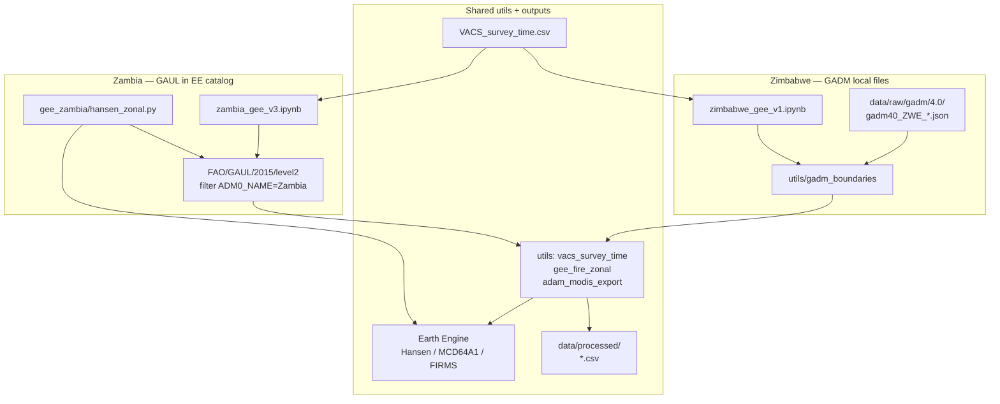

# Google Earth Engine (this folder)

**`hansen_zonal.py`** — CLI zonal sum of Hansen forest **loss** to Zambia **GAUL 2015** admin‑2.  
**Notebooks** — fire / MODIS / FIRMS live under [`exposure_notebooks/`](../exposure_notebooks/) (not here).

| Notebook | Country | Boundaries |
|----------|---------|------------|
| [`zambia_gee_v2.ipynb`](../exposure_notebooks/zambia_gee_v2.ipynb) | Zambia | EE auth smoke tests |
| [`zambia_gee_v3.ipynb`](../exposure_notebooks/zambia_gee_v3.ipynb) | Zambia | **FAO GAUL 2015** level 2 |
| [`zimbabwe_gee_v1.ipynb`](../exposure_notebooks/zimbabwe_gee_v1.ipynb) | Zimbabwe | **GADM 4.0** local GeoJSON via [`utils/gadm_boundaries`](../utils/gadm_boundaries.py) |

Full repo orchestration: [`README.md`](../README.md). GADM MODIS walkthrough: [`howto_docs/modis_gadm_country_pipeline.md`](../howto_docs/modis_gadm_country_pipeline.md).

## Orchestration

**Zambia today:** boundaries = GAUL; Hansen CSV default `data/raw/exposure_gee/zambia/hansen_loss_y2013_admin2_zambia.csv`.  
**Zimbabwe POC:** boundaries = GADM 4.0; MODIS deliverable `data/processed/zimbabwe_modis_mcd64_gadm40_2016.csv` (`ISO_2` = GADM `ID_2`).  
**Planned alignment:** same GADM 4.0 pattern for other countries (download `gadm40_{ID_0}_*.json` into `data/raw/gadm/4.0/`) — see howto doc.

## One-time Earth Engine access

1. [Earth Engine signup](https://code.earthengine.google.com/register)
2. `pip install -r requirements.txt` (same Python as notebooks / venv)
3. `earthengine authenticate`
4. Set **`EARTHENGINE_PROJECT`** in `.env` at repo root (or export it)

Details: [Python install & auth](https://developers.google.com/earth-engine/guides/python_install). If `ModuleNotFoundError: No module named 'ee'`, activate `.venv` or use `.venv/bin/python -m gee_zambia.hansen_zonal`.

## Country filter

- **GAUL (Zambia / this script):** [`GEE_country_scope.md`](GEE_country_scope.md)  
- **GADM (Zimbabwe / other countries):** local GeoJSON + `gadm_level2_feature_collection()` — not in the EE catalog
